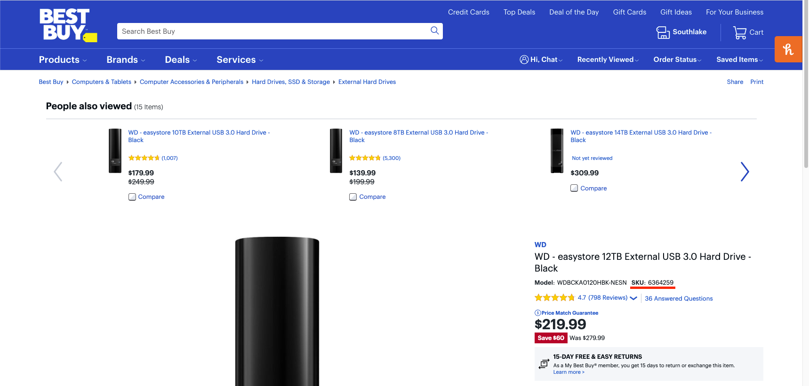

# Python Price Alert tool
I got tired of relying on email alerts from various price tracking websites like Honey so I decided to write this tool!
This tool will allow you to configure exactly how you want to be alerted to price drops ranging from simple push notifications to posting to webhooks.

Currently this tool supports BestBuy and Amazon.

## Alert tools that can be used with this tool
- [Pushover](https://pushover.net/) - Mobile push notifications (Premium $5 one time limit 7,500 notifications/month)
- [Pushbullet](https://www.pushbullet.com/) - Multi device push notifications (500 requests/ month for free)
- Webhooks - Zapier, Discord, etc
- ~~SMS - use gmail to send an SMS message to your phone~~ 

## Requirements
- For BestBuy Tracking:
1) A BestBuy Developer API key - [Get one here](https://developer.bestbuy.com/) (Can't use "free" emails at this time). Place this API key inside your `auth.ini` file after `BestBuyAPIKey=` (no quotation marks necessary)
- For Amazon Tracking
1) Nothing. This feature works using web scraping so no API is used.
## How to use this tool
1) Have python 3 installed.
2) Clone this repo
3) Configure which products you want to watch in the `items.json` file. For BestBuy we use the SKU to look up items using their free API. For Amazon we use the url of the product page. `alert_price` should be a float.
4) Rename `auth.ini.example` to `auth.ini` and fill out all the sections you want to enable then delete everything else. For example if you intend to just use this for Amazon price notifications you can remove the whole `[APIKeys]` section from this file. **WARNING**: DO NOT use quotation marks in the auth.ini file!

## FAQ:
Q) Where can I find the SKU of a BestBuy Item?

A) The SKU can be found on an individual product page under the title and to the right of the model number. It will typically be all numbers.

Q) What does alert_price mean in the `items.json` file and is it required?

A) alert_price is the the price you set to be alerted at. if the listing price is at or below your alert_price that is what will trigger you to be notified.

Q) Will I be alerted if my item is out of stock?

A) You will not be alerted if your item is not available for purchase, but your mileage may vary with Amazon Products.

Q) This thing isn't going to spam me with notifications is it?

A) Nope! This tool is completely configurable in terms of notification frequency. in the `auth.ini` file you can specify `daysBetweenAlerts` inside the `[Alerts]` section (defaults to 1) to adjust how frequently you get notifications when a product is less than or equal to your alert_price
